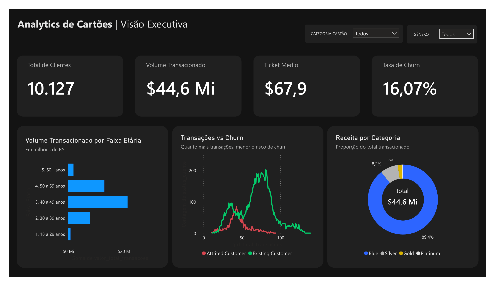

# 💳 Credit Analytics: Previsão de Churn e Comportamento Financeiro

###  Visão Geral do Produto de Dados
Este projeto simula o ecossistema de Analytics de uma instituição financeira. O objetivo central foi analisar uma base de mais de 10.000 clientes de cartão de crédito para mapear o **Risco de Churn (Evasão)** e entender os impulsionadores de receita, traduzindo dados brutos em inteligência acionável para equipes de CRM e Produto.

###  Arquitetura e Stack Tecnológica
A pipeline foi desenhada ponta a ponta, focando em boas práticas de Engenharia e Análise de Dados:
* **Python (Pandas, Seaborn):** Ingestão de dados (*Kaggle*), limpeza rigorosa de *schema*, tratamento de dados anômalos e Análise Exploratória (EDA).
* **SQL (SQLite via SQLAlchemy):** Simulação de um ambiente relacional em memória para extração de métricas de negócio e segmentação de clientes.
* **Power BI:** Desenvolvimento de Dashboard Executivo (Dark Mode) focado em UI/UX e Storytelling de dados.

###  Principais Descobertas e Regras de Negócio
1. **O Gatilho de Cancelamento:** Identificamos através da modelagem que a *inatividade antecede o churn*. Clientes que realizam **menos de 50 transações anuais** entram em uma zona de risco crítico, independentemente do limite de crédito.
2. **Perfil de Consumo:** A faixa etária entre 40 e 49 anos é a principal responsável pelo volume transacionado (+$20M), sendo o público-alvo prioritário para campanhas de *upsell* das categorias de cartão Gold e Platinum.
3. **Alvos de Retenção:** Criamos uma *query* SQL parametrizada para listar automaticamente clientes de alto valor financeiro (>$4.000) que apresentam queda drástica na frequência de uso, gerando um mailing direto para atuação preventiva do CRM.

###  Dashboard Executivo
*(Visão focada na conversão e comportamento de risco)*

### 🚀 Como Executar o Ambiente
1. Clone o repositório: `git clone https://github.com/LarissaGois/credito-analytics.git`
2. Ative o ambiente virtual e instale as dependências: `pip install -r requirements.txt`
3. Execute o notebook `notebooks/01_limpeza_e_eda.ipynb` para processar a pipeline completa (Python).
